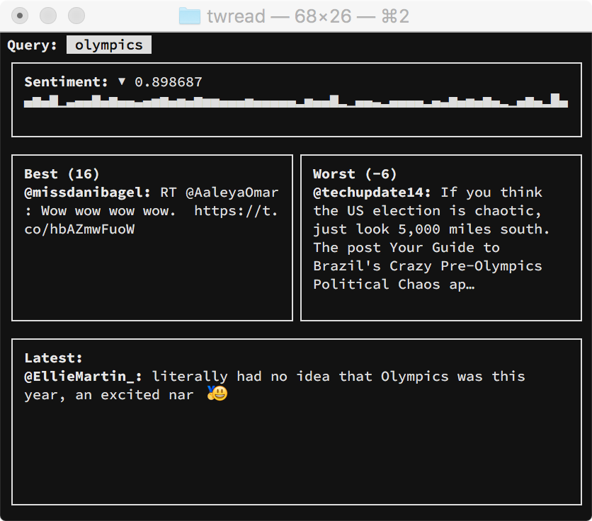

# wdtt

What does twitter think? A tiny little tool to keep you
informed on what twitter thinks about some keywords.
You don't need it. But you want it. (Looks best on
Source Code Pro with 10pt font).

Features:

 - Opinionated design.
 - Sparklines (everybody needs some).
 - Code that barely works.
 - Sentiment analysis.
 - No colors.
