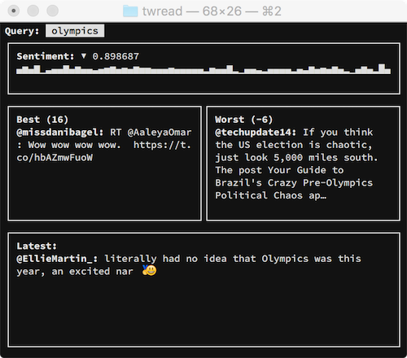

# wdtt

What does twitter think? A tiny little tool to keep you informed on
what twitter thinks about some keywords. You don't need it. But you
want it. As it stands the UI and features are complete. I don't find
myself needing anything more from it, so what remains will probably
just be performance improvements or codebase cleanups.

(Looks best on Source Code Pro with 10pt font).

Features:

 - Opinionated design.
 - Sparklines (everybody needs some).
 - Sentiment analysis.
 - No colors.
